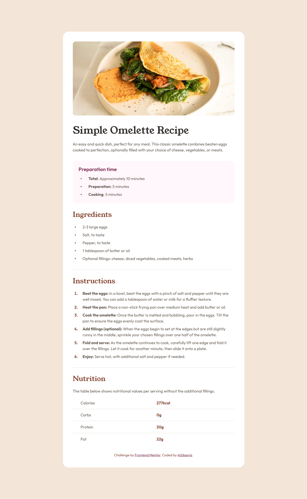

# Frontend Mentor - Recipe page solution

This is a solution to the [Recipe page challenge on Frontend Mentor](https://www.frontendmentor.io/challenges/recipe-page-KiTsR8QQKm). 

## Screenshot

## Links

- Solution URL: [GitHub](https://github.com/2daaria/Recipe-page)
- Live Site URL: [Live](https://2daaria.github.io/Recipe-page/)

## Built with

- Semantic HTML5 markup
- CSS custom properties
- Flexbox